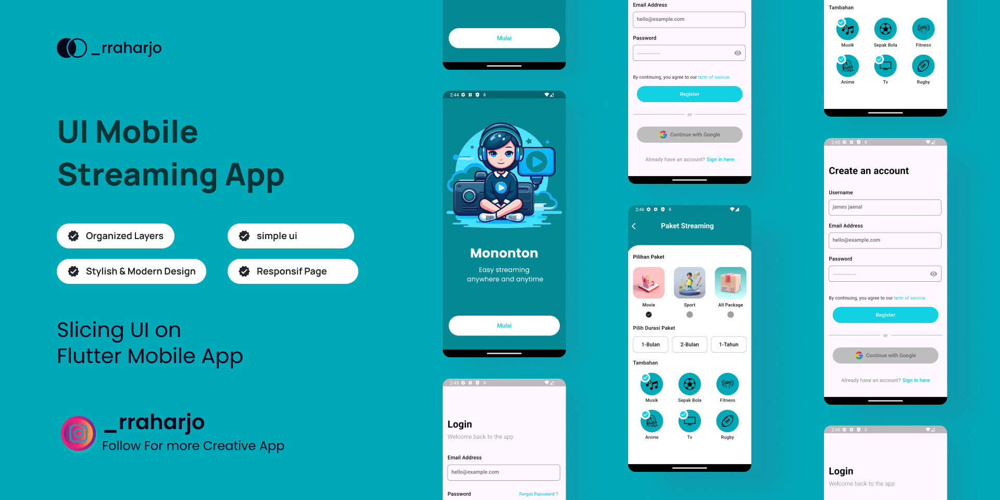

# Streaming App UI

This repository contains the code for a modern, responsive, and visually appealing Streaming App UI built using Flutter. The project is designed to showcase the potential of Flutter for developing clean and efficient user interfaces, optimized for various screen sizes and devices.

## Features

- **Responsive Design**: The UI is crafted to automatically adjust its elements to fit different screen sizes, providing a consistent experience across mobile devices.
- **Custom Widgets**: Utilizes reusable custom widgets to maintain clean code and enhance UI consistency.
- **Flexible Layouts**: Implements Flex, Grid, and Stack layouts to achieve a dynamic and adaptive interface.
- **Smooth Animations**: Includes smooth and engaging animations to improve user experience.
- **Theme Support**: Supports light and dark modes, allowing users to switch between themes seamlessly.

## Screens

- **Login Screen**: A user-friendly login page that adapts to different device sizes without scrolling, ensuring a consistent experience.
- **Home Screen**: Displays a curated list of content with attractive thumbnails, categories, and personalized recommendations.
- **Detail Screen**: Showcases detailed information about selected content, including descriptions, ratings, and related media.
- **Profile Screen**: Allows users to view and manage their profiles with an elegant and intuitive interface.

## Getting Started

To get started with this project:

1. Clone the repository:
   ```bash
   git clone https://github.com/your-username/streaming-app-ui.git
Navigate to the project directory:
- cd streaming-app-ui

Install dependencies:
- flutter pub get
  
Run the app:
- flutter run
  
Contribution
Contributions are welcome! If you have ideas for improvements or new features, feel free to fork the repository, create a new branch, and submit a pull request.

License
This project is licensed under the MIT License - see the LICENSE file for details.
